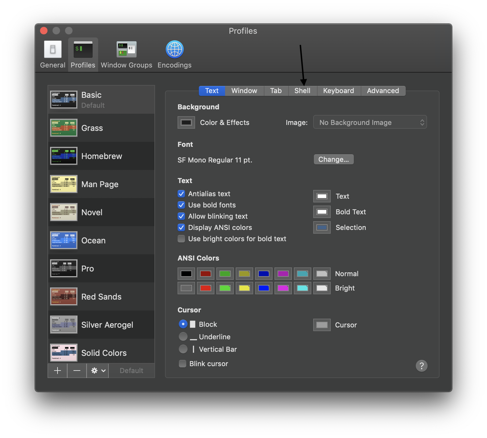
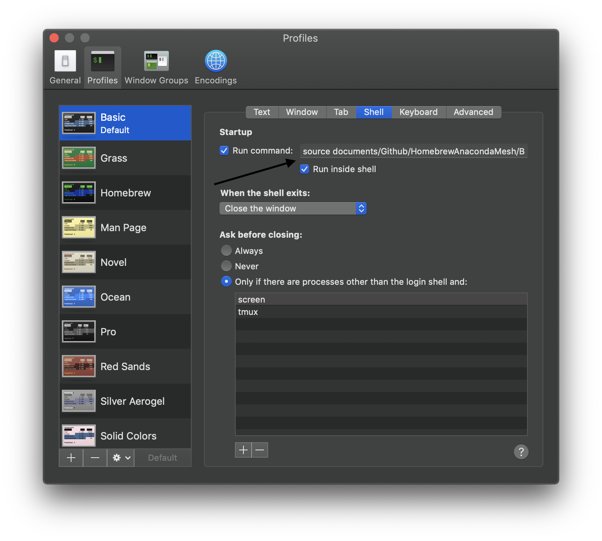

# HomebrewAnacondaMesh
This shell file lets MacOS use [HomeBrew](https://brew.sh) and [Anaconda](https://www.anaconda.com) on the same system, on same path by using a trick made by [Ifu Aniemeka](https://hashrocket.com/blog/posts/keep-anaconda-from-constricting-your-homebrew-installs). This will help you so you don't need to type out the command every time you close and open Terminal.

# Index
* [Setting up Locally](#setting up locally)
* [Summary](#summary)
* [Questions?](#questions)
* [License](#license)

## Setting up Locally

1) Start by [Forking this repo](https://github.com/RyanBarclay/HomebrewAnacondaMesh).

2) Clone repo to your development environment:
```
git clone git@github.com:username/HomebrewAnacondaMesh.git
```

3) Copy and paste this into Terminal
```
#this will be your location of the cloned repo
#for me its here
cd documents/Github/HomebrewAnacondaMesh

#allow this to file to be executed
chmod +x BrewAnacondaFix.sh

#go back home
cd ~
```

4) Open **Terminal &rarr; Preferences &rarr; Profiles**

5) It should look like this, And you want to click on "**Shell**" 

6) Once there copy this:
  ```
  source documents/Github/HomebrewAnacondaMesh/BrewAnacondaFix.sh
  ```
  Into here:
  
7)**DONE**. Now quit out of Terminal see if it worked.

## Summary

What we did here was:
  1. Make a copy of this repository on your local system.
  2. Gave permission to execute the shell file that makes this all work.
  3. Made Terminal run the shell file every time Terminal is opened.
  4. To test just type
  ```
  brew doctor
  ```
  and it should output this
  ```
  Medusa decapitated.
Your system is ready to brew.
Perseus defeated.
  ```
  
## Questions?

Contact me at [mrryanbarclay@gmail.com](mailto:mrryanbarclay@gmail.com)

## License
[MIT](https://choosealicense.com/licenses/mit/)
